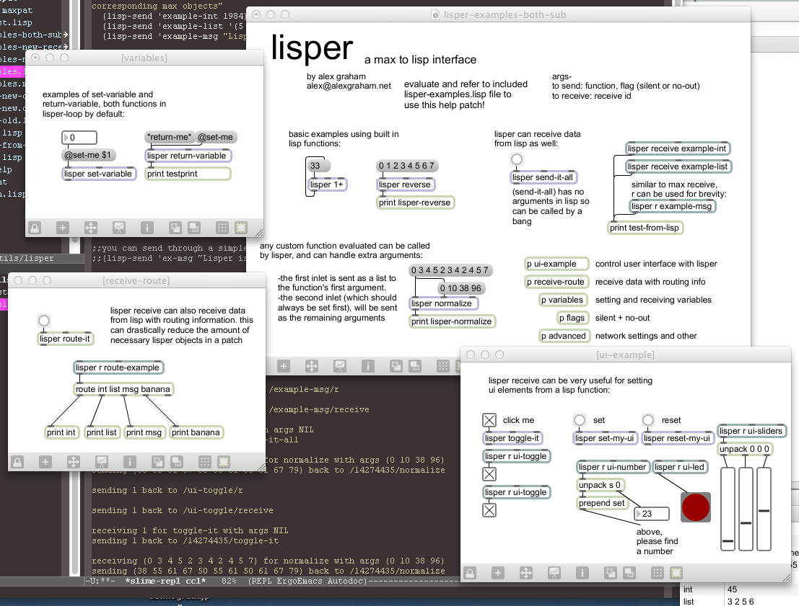

Lisper
=======
a Max/MSP interface for Clozure Common Lisp

by Alex Graham 
alex@alexgraham.net
(with thanks to Nik Gaffney for his OSC framework 
and Peter Elsea for his CCL implementation)

Overview
----------
Lisper is an interface which allows easy correspondence between Max/MSP and Lisp with minimal work for the programmer. It allows for both Max and Lisp to do what they do best: Max handling real time input, output, timing and control, letting Lisp handle variable handling and of course the processing of large amounts of data.

Lisper is built up of two parts, a max object called "lisper" and a lisp control loop function called "lisper-loop". When lisper-loop is run in a listener, a lisper object can call and send data to any function that has been loaded/evaluated in Lisp, and receive the returned data through that same lisper object. There is also a function called "lisper-send" which can send data from Lisp to a matching lisper object residing in Max.

Installation
-------------
1. Place lisper.maxpatch and lisper.maxhelp somewhere in your Max externals folder.
2. If you do not have the CNMAT objects already installed, also place the correct "osc-route" in your externals folder.
3. Move lisper-loop.lisp, osc.lisp and osc-dispatch.lisp in a utilities folder or any folder easily loaded from Lisp.
4. To start using Lisper, load osc.lisp, osc-dispatch.lisp and lisper-loop.lisp (in that order), and then evaluate (lisper-loop) in a listener. In a Max patch, create a lisper object with the name of a function you'd like to call, and send a list or a bang to it.

Usage
------------

The best way to learn to use Lisper and to see what it can do is to check out the lisper help file and lisper-examples.lisp. Definitely do this!!

NOTE: Lisper is currently tested with Clozure Common Lisp and Max 5. I don't see why it shouldn't work with Max 4, if osc-route can function. I think it would work with SBCL and such with a little modification to the port openings and such. 

Feel free to adapt lisper to your own needs and don't hesitate to contact me at alex@alexgraham.net with comments, suggestions or whatevers!

Parameters
-------------

Parameters you can currently use with (lisper-loop):

- :silent t (default nil) - lisper-loop will not echo any information into the REPL
- :ignore-errors t (default nil) - lisper-loop will notify you of most Lisp related errors, but will not break from the loop. Use at your own risk!
- :port (default 7800) - The OSC port lisper is listening and sending on, NOTE: set the same port number in Lisp and Max, Lisper will automatically set listen/send correctly!

Parameters for the lisper object:

parameter 1-
- function name: this function is the function lisper-loop will call

parameter 2-

- no-out : lisper-loop will not send back any information to Max.
- silent : Max can receive data back, but lisper-loop will not echo anything in the Listener

To send data from a Lisp function to a lisper objects directly, create the max object as:
"lisper from-lisp id" and call (lisp-send 'id "message"/int/(list)) - there is an example in the example file
